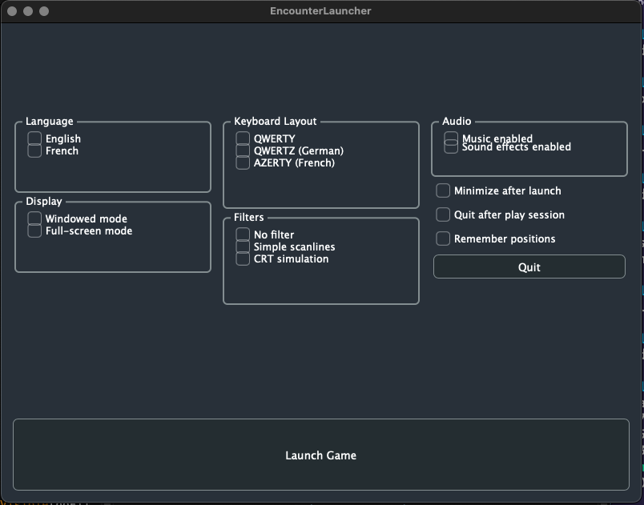

DBugs' wonderful Encounter project for the Oric-1/Atmos computers [1] comes with a pre-app launcher which allows the user to configure some important settings before launching Oricutron, and subsequently the Encounter .DSK file, to play.

This launcher is not cross-platform alas, so this is an attempt to implement the launcher features in JUCE, a modern cross-platform framework.

This is a CMake-based project which should build for all the relevant platforms with relative ease.

Current Status: only the basics of the UI are laid out, they don't work properly yet, and it won't actually launch anything.  But the rest of the scaffolding is there to produce a cross-platform (Mac/Windows/Linux/Steam) launcher application.  Its always the last 10% ..

[1] - https://store.steampowered.com/app/3319780/Encounter/

