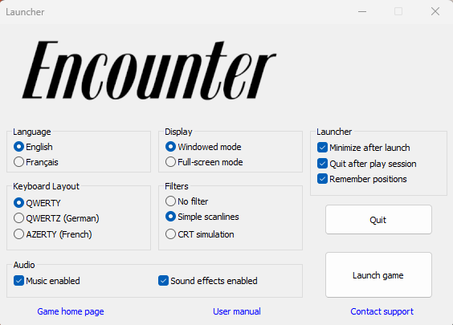

DBugs' wonderful Encounter project for the Oric-1/Atmos computers comes with a pre-app launcher which allows the user to configure some important settings before launching Oricutron, and subsequently the Encounter .DSK file, to play.

This launcher is not cross-platform alas, so this is an attempt to implement the launcher features in JUCE, a modern cross-platform framework.

This is a CMake-based project which should build for all the relevant platforms with relative ease.

